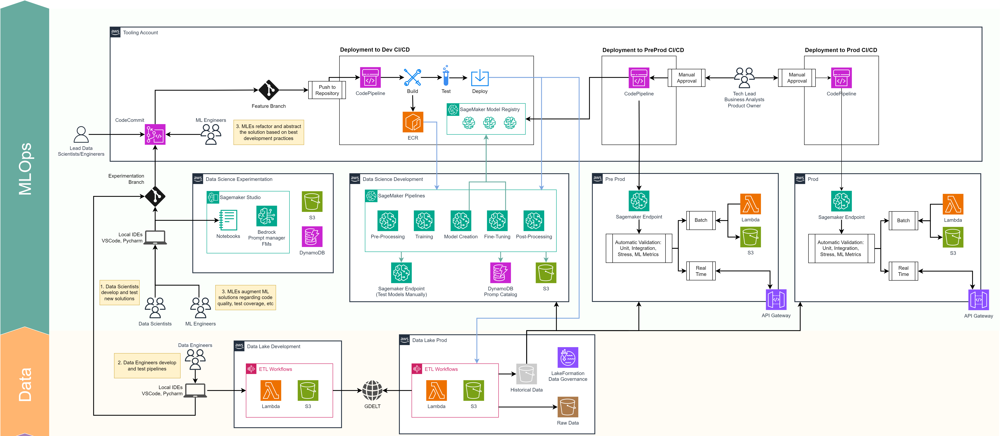

# Factored Datathon 2024

## Overview

The Factored Datathon 2024 project aims to delve into GDELT events data, specifically focusing on sanctions-related events. This repository includes Exploratory Data Analysis (EDA) notebooks, machine learning models, and Streamlit applications.

[Executive Summary](docs/GDELT_Project.pdf)

### Components

- **Data Handling**: Packages designed to efficiently manage large volumes of data using Spark.
- **Data Analysis**: Notebooks and packages for data cleaning, merging, and analysis.
- **Machine Learning**: Models developed to predict the Goldenstein Scale.
- **Streamlit Application**: An app that integrates LLM models with Agents, Tools, and RAG to interact with the data.

### Infrastructure

Although this project does not include full infrastructure implementation and only provides a simple local version using Streamlit and Spark, the proposed infrastructure for cloud deployment (using AWS as an example) is outlined below:



## Local Installation

### Using Conda

To set up the project environment with Conda:

```bash
cd $HOME && git clone git@github.com:glev1/factored-datathon-2024-seed42.git
cd $HOME/factored-datathon-2024-seed42
conda create -n datathon python=3.11
conda activate datathon
pip install -r requirements.txt
```

### Using venv
To set up the project environment with venv:

```bash
cd $HOME && git clone git@github.com:glev1/factored-datathon-2024-seed42.git
cd $HOME/factored-datathon-2024-seed42
python3.11 -m venv .venv
source .venv/bin/activate
pip install -r requirements.txt
```

## Structure and Usage
### EDA Files
The EDA notebooks are available at [notebooks/sanction_analysis.ipynb](notebooks/sanction_analysis.ipynb).

### Goldenstein Scale Predictor
Details about the Goldenstein Scale Predictor are coming soon.

### Streamlit Application
To run the Streamlit application, you need to set your OpenAI API key. This project uses GPT-4 and currently does not support other LLM models, so an API key is required.

Set the API key with the following command:

```bash
export OPENAI_API_KEY=<your-key>
```

Run the Streamlit application using:

```bash
streamlit run ./app/chat_app.py
```

Ensure you are in the root directory of the project (factored-datathon-2024-seed42) when executing this command. The application will open in your browser, allowing you to interact with the interface to scrape data from GDELT and perform query-based tasks.

### Packages
Various packages and utilities have been developed to facilitate project development. They are organized in the [packages directory](packages) and can be utilized in other Python files as methods and classes.


